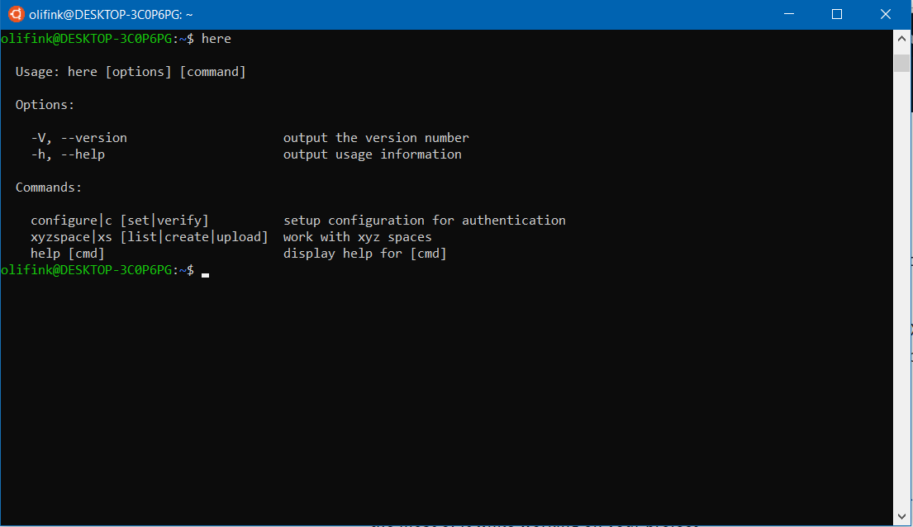

# HERE CLI

We think developers deserve an easy to use, convenient and streamlined experience to work with XYZ Hub APIs. That’s why we’ve built the HERE CLI. HERE CLI is a Node.js command line interface which works not only with HERE XYZ Hub, but eventually, with any HERE API. Right now, it allows you to interact with HERE XYZ Hub to create and manage your Projects and easily upload and manage your datasets.

[](../assets/images/cli.png)

!!! tip "HERE CLI on GitHub"
    [HERE CLI is Open Source](https://github.com/heremaps/here-cli), where developers like yourself can contribute new functionality and features.

In this section, we'll quickly introduce you to the HERE CLI, how to install it and how to make the
most of it while working on your project.

## Introduction

As mentioned before, the HERE CLI was built to make your life as a developer working with HERE APIs
easier. It allows you to quickly try out new APIs to see how they behave before you get on to your
keyboard to actually develop an application. It can also be used to easily script common, repetitive
tasks or help in testing application logic or data.

## Quick Start

HERE CLI is built on Node.js, a cross-platform efficient language to write even complex, local applications.

### Install Node.js and npm

To use the new HERE CLI, you should have npm installed. The best way is to go to
[nodejs.org](https://nodejs.org/en/download/) and install the appropriate package for your
system (both 8.x LTS and 10.x Current should work).

#### Windows

Download the package and install it normally.

Alternatively, if you use a [package manager](https://nodejs.org/en/download/package-manager/#windows) like [Chocolatey](https://chocolatey.org/)
you just need an administrative cmd.exe/powershell.exe and run

```
choco install -y nodejs
```

#### macOS

Similarly on macOS you can just download and install the `.pkg` package file.

You can also use your favorite [package manager](https://nodejs.org/en/download/package-manager/#macos), like homebrew:

``` sh
brew install node
```


#### Linux (Ubuntu, Fedora, Gentoo etc)

Follow the instructions at the [Node.js Package Manager](https://nodejs.org/en/download/package-manager/) site, find your dist and install the packages.

For [Debian or Ubunbtu](https://nodejs.org/en/download/package-manager/#debian-and-ubuntu-based-linux-distributions)
it looks something like this:

```
curl -sL https://deb.nodesource.com/setup_8.x | sudo -E bash -
sudo apt-get install -y nodejs
```

To be on the safe side you might want to install the optional `build-essentials` package as you might come across
native packages eventually and it's good to have the right tools around.

#### Check that it works

After installing, check in the command-line if `npm` is available. Depending on how you installed it you might need to close and reopen your terminal or command-line prompt.

```
$ npm -v
5.x.x
```


### Install HERE CLI

When you are sure your system has `node` and `npm` installed you can go ahead and install the latest
version of HERE CLI with following command:

``` sh
npm install -g @here/cli
```

!!! note "Administrative permissions"

    Depending on your system, you might need elevated system permissions to install **globally** with `-g`,
    which essentially means you can call the `here` command from anywhere.

    To elevate you permissions, either start an **Admin Command Prompt** or **Admin PowerShell** on Windows,
    or use `sudo` on Linux or macOS.

### Configure HERE CLI

HERE CLI needs to have access to your projects to help you work with your data. For that, you
need to configure your `appId` and `appCode`. You only need to do this once for a project.

``` sh
here configure set
```

When prompted, enter your `appId` and your `appCode`.

The CLI will immediately try to *verify* if the entries can be
used to log into HERE XYZ and report back to you accordingly.

!!! question "Where is my `appId` and `appCode` stored?"

    Don't worry, the information entered is safely stored and encrypted on your local machine (if you are curious, look for a file called `.herecli` in your home directory
    which contains the configuration data)
