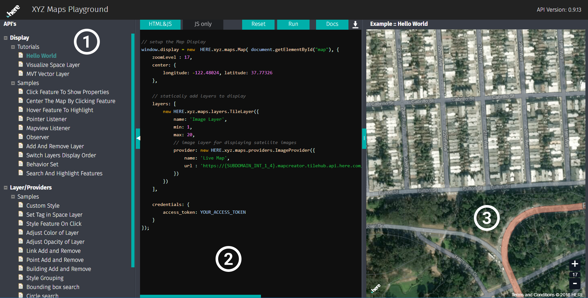

The easiest way to get data from an HERE XYZ Hub Space onto a map is by using our
XYZ Maps JavaScript component in your web pages.

## Maps Playground

To help you get started we have the playground, an easy to use exploration tool
that gets you up to speed quickly with the most important concepts. By showing both
the code and the result it is the best way try out unfamiliar APIs. Because the code is also
directly editable, you can experiment directly in the browser to try out new things.

[`https://xyz.api.here.com/maps/`](https://xyz.api.here.com/maps/)

!!! tip "Using a sample as a template for your project"

    Using one of the samples is probably the easiest way for you to start your own
    visualization project. By clicking the download button on right side of the editor
    toolbar you can download the current file as a starter `.html`-file for your project.

    

    The only thing left to do is to replace the `YOUR_TOKEN` placeholder with the actual
    string for your token.

### Concepts (1)

The left-hand side panel shows a list of concepts for you to explore. They are ordered into
groups like basic concepts to start with or more complex interactions for you to try out.

Selecting one of the samples loads it into the Editor panel (2) and shows the result in the
Map Output panel (3).

### Editor (2)

The editor in the middle shows the code for sample. It uses different colors for different symbols
based on their meaning (syntax highlight). This is especially helpful if you made changes and
forgot something (like closing a bracket or ending a string quote).

#### Documentation

This is probably the most helpful link you can find, and it takes you directly into the `JSDoc`
documentation site. You can also bookmark this for further reference:

[`https://xyz.api.here.com/maps/latest/documentation`](https://xyz.api.here.com/maps/latest/documentation/index.html)

#### Switch Code Views
As normal for a web application it consists
of both HTML and JavaScript. Usually, the interesting stuff happens in JavaScript - that's why
this view is preselected. However, you can also see the JS in context by switching to the
**HTML&JS** tab with the corresponding button in the toolbar.

#### Run Code

As mentioned already, you can (and are encouraged to) make changes to the code and observe the
output immediately. For this, you need to press the **Run** button in the toolbar.

#### Reset Code

Don't worry if you make mistakes, you can also always go back to the default version of text example
by selecting the **Reset** button.

#### Download Code

Note that there is helpful little **download** icon on the right hand side of the toolbar
that allows you to download the code the example (with your changes) and use it as a starting
point for you own application. There are still some small changes you need to make, like
replacing the text `YOUR_TOKEN` with the string of your actual token (and don't forget to
put in quotes, like this: `"xyz9876"`).

!!! hint "Playground access to your data"

    The playground uses it's own credentials and token to access the Spaces used in the
    samples. This token doesn't show in the code.

    If you want to use your own data, add the token where you need it, either by globally
    setting `YOUR_TOKEN` or by adding it to specific `credentials` configuration as the
    `access_token:`

### Map Output (3)

You will see the result of the example or your experiment in the right hand panel.
The output is fully interactive.

If you have coded yourself into a corner and the map doesn't work anymore as expected
you can always **Reset** the sample back to it's original state where it should work.

!!! hint "Also look into your browsers **Developer Tools** for messages"

    It also help to understand what's going to open your browsers Developer Tools
    (for Chrome press `CTRL-SHIFT-I` or `CMD+OPTION+I` on macOS). There you see
    console messages and network information for what content gets loaded, especially
    when pan and zoom the map.
